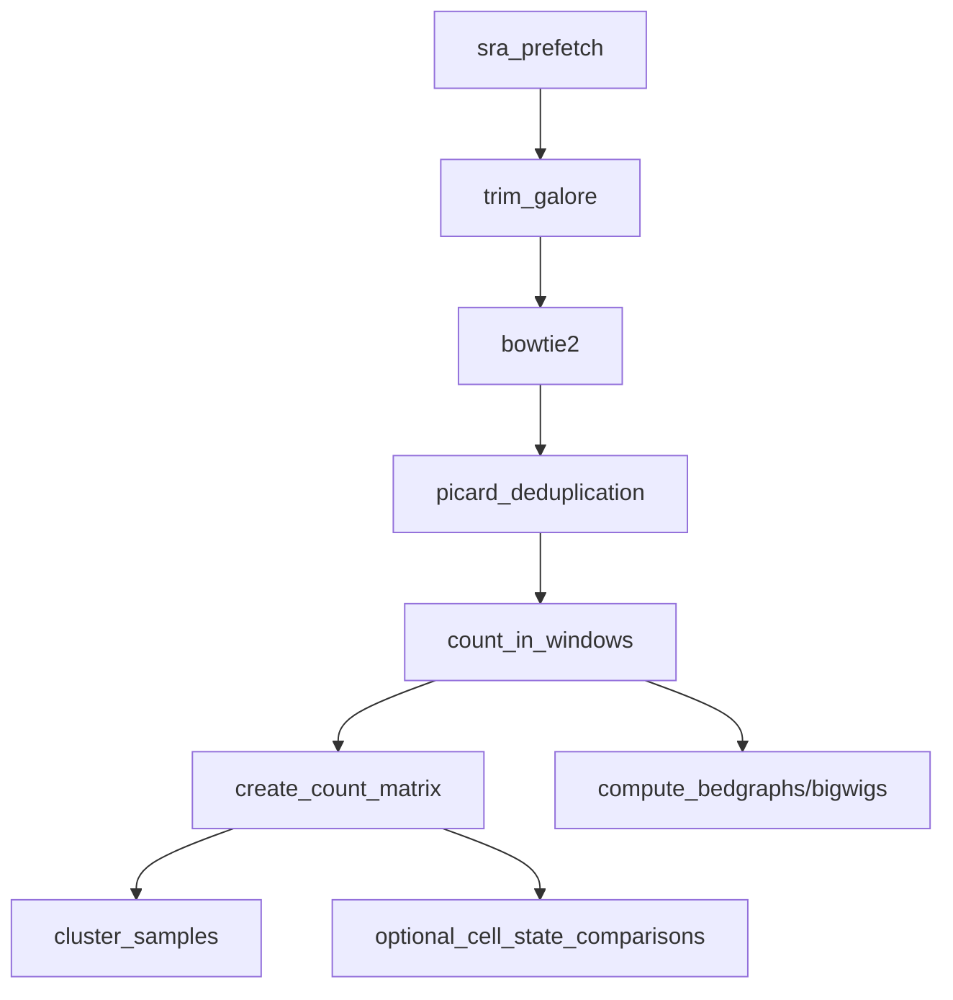

# epi-refs-smk_v8

## Rational

- `Epi-refs-smk_v8` is a basic and for sure to simplified `snakemake` pipeline to quickly generate epigenomic references
for downstream project.
- Installation of the base snakemake v8 conda env: `conda env create -f base_smk_8v.yml`
- Add the epigenomic references here: `config/sample_manifest.tsv`

## Set up

1. Install the base snakemake env
2. Fill out the `config/sample_manifest.tsv`
  - Read the `config/sample_manifest_notes.md`
3. Set the corresponding reference genome in `config['REFERENCE_GENOME]`

## Workflow overview

