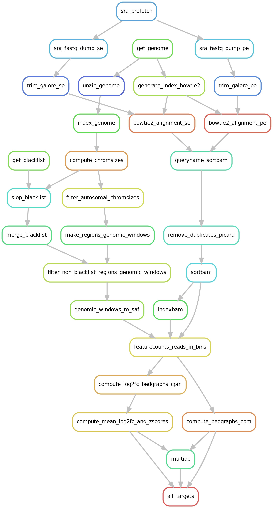

# epi-refs-smk_v8

## Rational

- `Epi-refs-smk_v8` is a basic and for sure to simplified `snakemake` pipeline to quickly generate epigenomic references
for downstream projects.
- Installation of the base snakemake v8 conda env: `conda env create -f base_smk_8v.yml`
- Add the epigenomic references here: `config/sample_manifest.tsv`
- This pipeline is very conservative in processing and instead of adding a pseudocount it rather drops sites with
  insufficient coverage.

## To dos

- [ ] Implement peak calling
- [ ] Implement a window based analysis
- [ ] Call chromatin states using ChromHMM or another model

## Set up

1. Install the base snakemake env
2. Fill out the `config/sample_manifest.tsv`
  - Read the `config/sample_manifest_notes.md`
3. Set the corresponding reference genome in `config['REFERENCE_GENOME]`
  - Check whether it is available at `UCSC` if not:
  - Set the config['USE_CUSTOM_GENOMES'] to `True` and specify the config['CUSTOM_GENOME_PATH']
  - `CUSTOM_GENOME_PATH` can be a local or remote file, the pipeline also handles compressed or uncompressed reference
    genomes.
3. Enable / disable whether both reads of a paired read sequencing experiment should be considered
  - config['PE_SEQ_USE_SINGLE_READ'] 
  - specify: 1 for read 1, or 2 for read 2, or leave empty if not entended
  - The pipeline will align both reads but then only considers one read in the downstream processing after the PCR deduplication
4. Enable / disable the usage of the blacklists with `config['REMOVE_BLACKLISTED_REGIONS']`
  - To be as flexible as possible one can switch on / off the usage of precomputed blacklists.
  - Keep in mind it is likely when using custom genomes (config['USE_CUSTOM_GENOMES']) no blacklist exist, therefore it
    should be disabled.
5. Enable / disable the autosomal chromosome filtering `config['FILTER_AUTOSOMAL_CHRS']`
  - Same reasoning as 4. custom genomes might have different chromosome names and therefore autosomal filtering will
    lead to wrong exclusion of chrs. Currently filtering assumes chromosome names are: `chr1... chr20`

## Workflow overview

